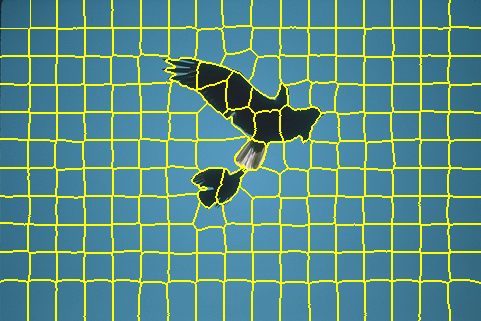
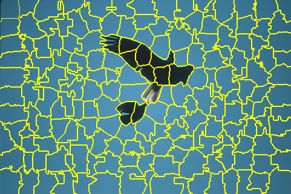

# SNIC

This repository is for data mining course (2021 spring), and it includes:

* SNIC algorithm reimplementation and visualization in Python (``snic.py``).
* Comparison with original implementation (``matlab/compare_reimpl.m``).
* SNICO algorithm that gets rid of compactness parameter (``snic.py``).
* Superpixel merging algorithm based on RAG and NNG (``merge.py``).

*Note: visualization based on C++ implementation is not implemented yet (``snic.cpp``).*
